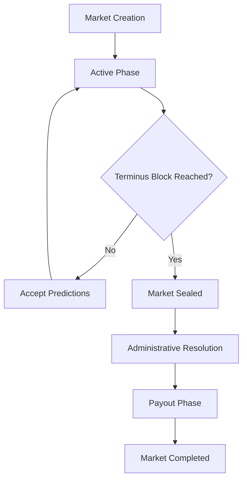

# VeridixWager

**Decentralized Prediction Market Platform on Stacks Blockchain**

VeridixWager is a sophisticated prediction market platform that enables users to create, participate in, and resolve prediction markets using STX tokens. Built with transparency, decentralization, and fairness at its core.

## Features

### Core Functionality
- **Market Architecture**: Create custom prediction markets with multiple scenarios
- **Flexible Mechanisms**: Support for three distinct payout mechanisms
- **Decentralized Resolution**: Community-driven market adjudication
- **Capital Efficiency**: Proportional and fixed-probability reward systems
- **Temporal Controls**: Block-height based market expiration

### Market Types
1. **Absolute Winner**: Winner-takes-all mechanism where victors split the entire pool
2. **Proportional Share**: Payouts proportional to individual stake contributions  
3. **Fixed Probability**: Predetermined odds-based return calculations

##  Smart Contract Architecture

### Data Structures
- `prediction-markets`: Core market metadata and state management
- `participant-stakes`: Individual participant positions and commitments
- `supported-mechanisms`: Configurable payout mechanism registry

### Key Functions

#### Market Creation
```clarity
(architect-prediction-market synopsis scenarios terminus-block mechanism-type probabilities)
```
- Creates new prediction markets with customizable parameters
- Validates scenario counts, mechanism types, and temporal constraints

#### Participation
```clarity
(commit-prediction market-id selected-scenario stake-magnitude)
```
- Allows participants to stake STX on specific market scenarios
- Supports cumulative staking on the same scenario

#### Resolution
```clarity
(adjudicate-market market-id victorious-scenarios)
```
- Administrative function to declare winning scenarios
- Supports multiple simultaneous winners (up to 5)

#### Claiming
```clarity
(harvest-returns market-id)
```
- Enables winners to claim their proportional rewards
- Automatic stake deletion after successful claims

##  Getting Started

### Prerequisites
- Stacks wallet with STX tokens
- Access to Stacks blockchain testnet/mainnet
- Clarity smart contract deployment tools

### Deployment
```bash
# Deploy to Stacks testnet
clarinet deployments apply --network=testnet

# Verify deployment
clarinet console
```

### Basic Usage

1. **Create a Market**
   ```clarity
   (contract-call? .veridix-wager architect-prediction-market 
     "Presidential Election 2028" 
     (list "Candidate A" "Candidate B" "Candidate C")
     u1000000  ;; terminus block
     "absolute-winner" 
     none)
   ```

2. **Place Prediction**
   ```clarity
   (contract-call? .veridix-wager commit-prediction 
     u0         ;; market-id
     u1         ;; selected scenario
     u1000000)  ;; stake amount in microSTX
   ```

3. **Claim Winnings**
   ```clarity
   (contract-call? .veridix-wager harvest-returns u0)
   ```

##  Market Lifecycle



##  Security Features

- **Temporal Validation**: Prevents premature market closure and late predictions
- **Authorization Controls**: Multi-tiered access control for critical operations
- **Capital Protection**: Comprehensive error handling and reimbursement mechanisms
- **Input Sanitization**: Robust validation for all user inputs and market parameters

##  Economics

### Fee Structure
- **Market Creation**: Free (gas costs only)
- **Predictions**: No platform fees
- **Claiming**: No platform fees

### Tokenomics
- Native STX token integration
- Direct peer-to-peer value transfer
- No intermediary token required

##  Monitoring & Analytics

### Read-Only Functions
- `get-prediction-market`: Retrieve complete market state
- `get-participant-stake`: Query individual participant positions
- `get-current-block-height`: Real-time blockchain state

### Market Metrics
- Total liquidity per market
- Participant distribution across scenarios
- Historical resolution accuracy